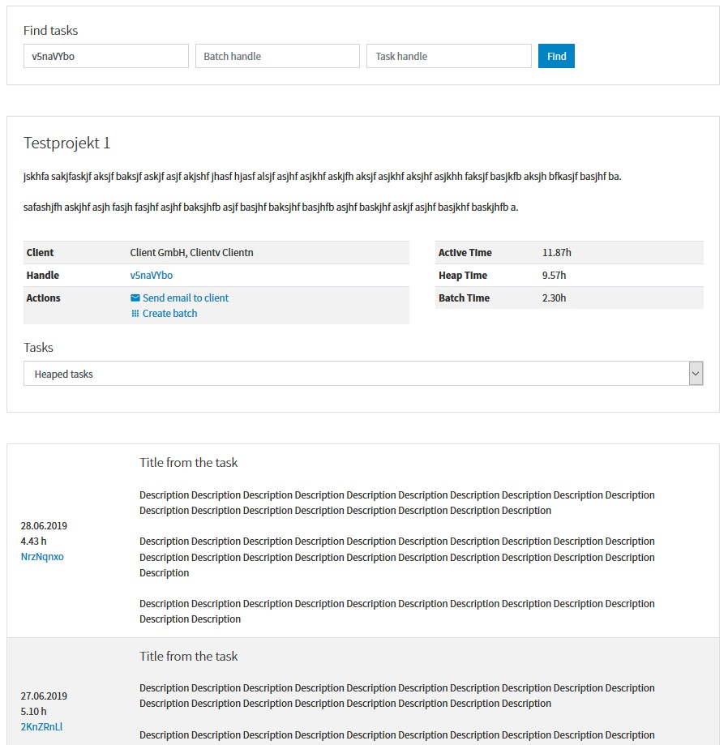
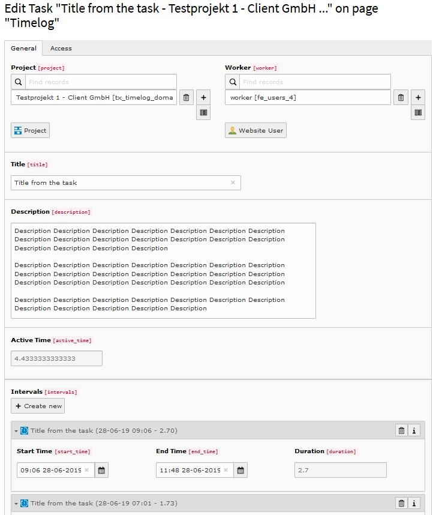
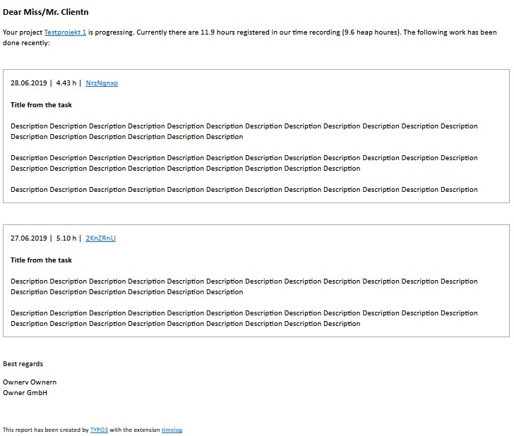

.. include:: /Includes.rst.txt

.. image:: https://img.shields.io/badge/TYPO3-11-orange.svg
   :alt: TYPO3 11
   :target: https://get.typo3.org/version/11

.. image:: https://img.shields.io/badge/TYPO3-10-orange.svg
   :alt: TYPO3 10
   :target: https://get.typo3.org/version/10

.. image:: https://github.com/buepro/typo3-timelog/workflows/CI/badge.svg
   :alt: Continuous Integration Status
   :target: https://github.com/buepro/typo3-timelog/actions?query=workflow%3ACI

============
Introduction
============

The aim from this extension is to increase the efficiency and transparency of work by continuously collecting work
information and communicate it to customers.

Work conducted for a project is split into tasks. Each task consists of intervals where an interval is a
timespan work has been conducted to without interruption. Tasks can be assigned to task groups and further
collected in batches to be used as references (e.g. in in invoices).

With a click information regarding the latest tasks worked on might be communicated to the client.

Screenshots
===========

Frontend view from task panel
-----------------------------

----

Backend view from task
----------------------

----

Email to client
---------------

