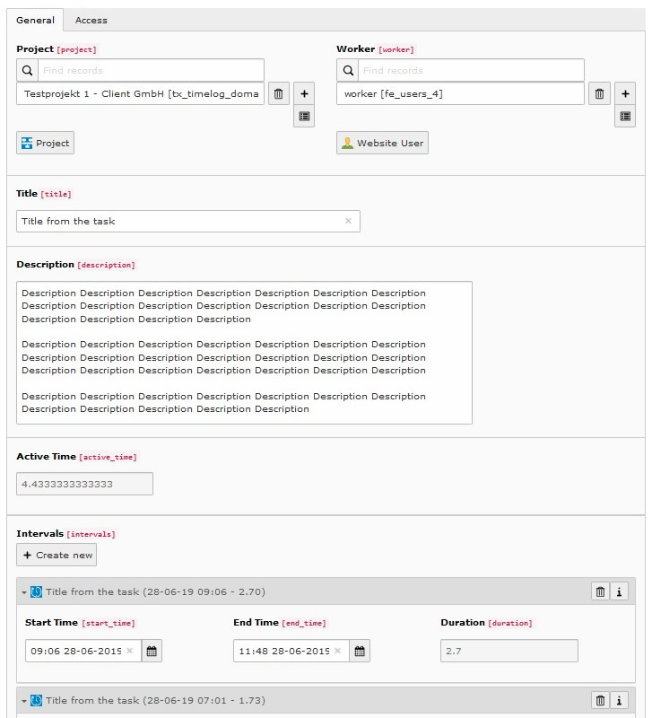

# TYPO3 extension timelog

---

The aim of this extension is to increase the **efficiency** and **transparency** of work by continuously collecting work 
information and communicate it to customers.

Work conducted for a **project** is split into **tasks**. Each task consists of **intervals**. An interval is a 
timespan where work has been conducted without interruption.

With a click the latest tasks carried out might be **communicated** to the client.

Tasks can be gathered in **batches** and might be used as reference in invoices.

## Documentation

- [Administration (installation, maintenance)](Documentation/Administration.md)
- [Configuration](Documentation/Configuration.md)
- [Usage](Documentation/Usage.md)

## Screenshots

### Frontend view from task panel

### Backend view from task

### Email to client

